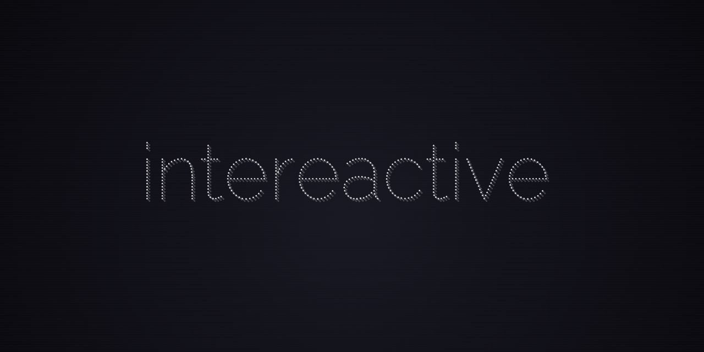

# intereactive



> The missing selection manager for React

## Getting Started

This library provides a variety of tools which enable specific use cases:

### Select / Autocomplete / Combo Box

`intereactive` can power Select-style components, giving you flexibility on DOM structure and implementation details. And you end up with a great semantic structure, free of render-prop noise:

```tsx
<SelectionProvider value={value} onChange={setValue}>
  <SelectInput
    value={inputValue}
    onChange={ev => setInputValue(ev.target.value)}
  />
  <SelectOptions>
    {filteredOptions.map(option => (
      <SelectOption value={option} key={option}>
        {option}
      </SelectOption>
    ))}
  </SelectOptions>
</SelectionProvider>
```

**See [the Select guide](./guides/select.md) to get started.**

### Toggle Buttons (1-dimensional roving tabindex)

Roving tabindex is a low-level technique to move the user's tab position between a grouped set of elements using the keyboard. Whenever focus leaves the group and returns to it, the selected element will still be where the user left it. This is great for constructs like Toggle Buttons, where selection is exclusive and all the buttons should be treated as one focusable widget.

**See [the Toggle Buttons guide](./guides/toggle-buttons.md) to get started**

### Tree (nested roving tabindex)

Recursive nesting structures are simple to achieve, by nesting roving tabindex items and specifying which keyboard interactions the user will utilize to navigate the structure.

**See [the Tree guide](./guides/tree.md) to get started**

### Grid (2-dimensional roving tabindex)

Grids are 2-dimensional navigation structures, where the user can use arrow keys to move up, down, left or right. A common type of navigable grid is a calendar control.

**See [the Grid guide](./guides/grid.md) to get started**

## Caveats

The logic required to conveniently and intuitively support complicated selection navigation in multiple dimensions does introduce a few caveats which must be considered.

### 1. Performance impacts based on DOM complexity and DOM mutations

To achieve the maximum level of stability and predictability for the ordering of selectable items in complex DOM structures, this library relies on scanning the child DOM tree when elements are added, removed, or re-ordered within a `<RovingTabContainer>` or any component you attach to `useSelectionItemsContainer` of the Selection system. It doesn't scan the entire document, just the elements nested under either of these containers.

Avoid unnecessary DOM modifications within these containers, and try to simplify their DOM structure as much as possible. Try to place the containers as close to the bottom of the DOM tree as possible (don't wrap more components in your container than is necessary to include all item children).

### 2. Lack of virtualization support

At the moment, virtualization is not supported. While it may be theoretically possible to support, it hasn't made it on the roadmap yet and will be pretty complex to implement.

### 3. Requirements around manual coordinates

When DOM structure can't properly infer the correct selection structure, manually supplying item coordinates is required. For instance, using CSS Grid for a grid layout means that the content is visually represented as a 2D grid, but in DOM the items are all still direct siblings. In such cases, you will need to pass the `coordinate` option to the `useRovingTabItem` hook to indicate where in the 2D structure the item lies.
